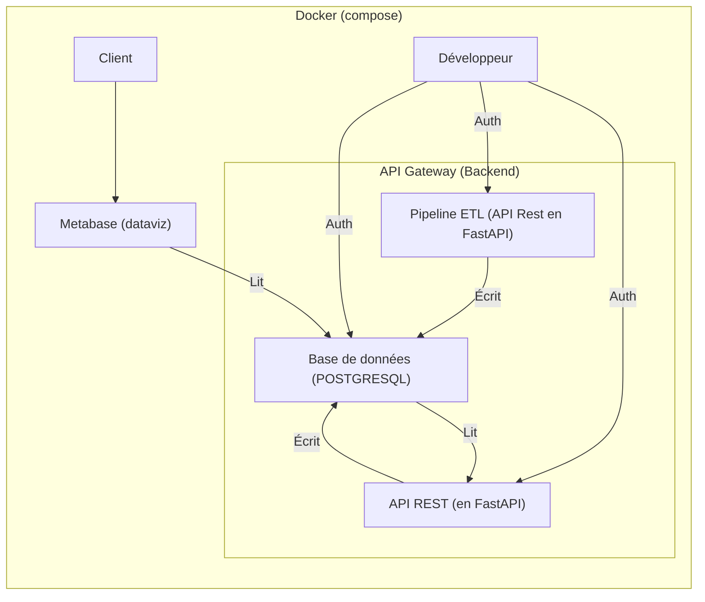

# EPSI B3 MSPRs

Voici le repository de notre groupe pour les MSPRs de la formation EPSI B3 en DEVIA et Data Science (Fullstack + DevOps).

Contributeurs :

1. Samuel RESSIOT
2. Tom WILK-RAVOUX
3. Alexandre PIERRE
4. Maxime DUSSORT

---

## **📜 Architecture logicielle du projet**  

### **Explication**

- **Docker (compose)** : Encapsule l'infrastructure logicielle.
- **API Gateway (Backend)** : Contient l'ETL et l'API REST, qui communiquent avec la base PostgreSQL.
- **Metabase** : Outil de visualisation de données connecté à PostgreSQL.
- **Client** : Interagit avec Metabase.
- **Développeur** : Accède aux services via authentification (Auth).

### **Schéma**



## **📜 Liste des technologies du projet**  

### **1️⃣ Backend (API REST FastAPI pour le CRUD)**  

| Technologie | Version | Raison du choix | Usage |
|-------------|---------|-----------------|-------|
| **FastAPI** | Latest | Performant, async natif, doc automatique | API REST |
| **Python** | 3.11+ | Langage flexible et puissant | Dev de l’API et de l’IA |
| **SQLAlchemy** | Latest | ORM puissant et compatible avec PostgreSQL | Gestion de la base de données |
| **Pydantic** | Latest | Validation et sérialisation des données | Modèles de données |
| **Celery** | Latest | Gestion des tâches asynchrones | Traitements en arrière-plan |
| **Redis** | Latest | Caching et gestion des files de tâches | Optimisation des performances |
| **PostgreSQL** | 15+ | Performant et robuste pour les données relationnelles | Base de données principale |
| **Docker** | Latest | Conteneurisation pour déploiement | Exécution en environnement isolé |
| **Gunicorn / Uvicorn** | Latest | Serveur WSGI/ASGI performant | Déploiement de l’API |
| **OAuth2 / JWT / Keyclock** | Latest | Sécurité et authentification | Gestion des utilisateurs et des permissions |

---

### **2️⃣ Frontend (Application NextJS)**  

| Technologie | Version | Raison du choix | Usage |
|-------------|---------|-----------------|-------|
| **Next** | Latest | Framework robuste et maintenable | Développement du frontend / API |
| **TypeScript** | Latest | Typage fort, maintenabilité | Langage principal |
| **TailwindCSS** | Latest | Styling moderne et flexible | UI et mise en page |
| **NGXS ou Redux** | Latest | Gestion centralisée du state | State management |
| **Metabase** | Latest | Open source | Data visualisation |

---

### **3️⃣ ETL (Traitement et nettoyage des données en FastAPI)**  

| Technologie | Version | Raison du choix | Usage |
|-------------|---------|-----------------|-------|
| **FastAPI** | Latest | Orchestration des workflows ETL | Planification des tâches |
| **Pandas** | Latest | Manipulation des données | Nettoyage et transformation des données |
| **DuckDB** | Latest | Traitement performant des datasets volumineux | Analyse et transformation |
| **SQLAlchemy** | Latest | ORM pour interagir avec les bases | Stockage des données |

---

### **4️⃣ Infrastructure & DevOps**  

| Technologie | Version | Raison du choix | Usage |
|-------------|---------|-----------------|-------|
| **Docker** | Latest | Conteneurisation | Isolation et portabilité |
| **Docker Compose** | Latest | Gestion multi-conteneurs | Environnements Dev & Prod |
| **Kubernetes (K8s)** | Optional | Scalabilité et orchestration | Gestion des déploiements |
| **Terraform** | Latest | Infrastructure as Code | Automatisation du déploiement |
| **Ansible** | Latest | Configuration automatisée | Provisioning des serveurs |
| **NGINX / Traefik** | Latest | Proxy et Load Balancer | Redirection et gestion des requêtes |

---

### **5️⃣ Observabilité et Monitoring**  

| Technologie | Version | Raison du choix | Usage |
|-------------|---------|-----------------|-------|
| **Prometheus** | Latest | Monitoring des métriques | Supervision des services |
| **Grafana** | Latest | Visualisation des métriques | Tableaux de bord et alertes |
| **ELK Stack (Elasticsearch, Logstash, Kibana)** | Latest | Centralisation et analyse des logs | Gestion des logs backend et frontend |

---

### **6️⃣ Sécurité**  

| Technologie | Version | Raison du choix | Usage |
|-------------|---------|-----------------|-------|
| **OAuth2 / JWT / Keyclock** | Latest | Authentification sécurisée | API et utilisateurs |
| **Vault** | Latest | Gestion des secrets | Stockage des clés et credentials |
| **Fail2Ban** | Latest | Protection contre les attaques | Sécurisation des serveurs |

## Installation

### 1. **Clonage du projet**  

Pour cloner le dépôt principal pour la première fois, exécutez :

```bash
git clone https://github.com/Sam-rst/EPSI_B3_MSPR-Groupe_MATS.git
```

### 2. **Initialisation de l'environnement**

Pour initialiser l'environnement de développement, exécutez :

```bash
docker-compose up -d
```

### 3. **Accès aux services**

TODO : Ajouter les liens liens des services

- **API REST** : [http://localhost:8000/docs](http://localhost:8000/docs)
- **Metabase** : [http://localhost:3000](http://localhost:3000)
- **Pipeline ETL** : [http://localhost:8000/etl](http://localhost:8000/etl)

---
