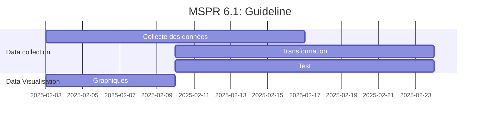

# EPSI B3 MSPRs

Voici le repository de notre groupe pour les MSPRs de la formation EPSI B3 en DEVIA et Data Science (Fullstack et DevOps :).

Contributeurs :

1. Samuel L. JACKSON
2. Tom JEDUSOR
3. Maximus ALBERTUS
4. Alexandre LE GRAND

## Guidelines



## Installation

Pour que les submodules Git soient bien initialisés et clonés automatiquement, voici les étapes à suivre :  

### 1. **Clonage avec les submodules**  

Pour cloner le dépôt principal pour la première fois, exécutez :

```bash
git clone --recurse-submodules https://github.com/Sam-rst/EPSI_B3_MSPR-Groupe_MATS.git
```

Cela va cloner le dépôt principal **et** initialiser directement les submodules.

---

### 2. **Mise à jour des submodules après un simple `git clone`**  

Si vous n'avez pas cloné le dépôt **sans** l'option `--recurse-submodules`, les submodules ne seront pas récupérés immédiatement. Pour les récupérer et les mettre à jour, il faut exécuter :  

```bash
cd EPSI_B3_MSPR-Groupe_MATS
git submodule update --init --recursive
```

---

### 3. **Mettre à jour les submodules**  

Les submodules ne se mettent pas à jour automatiquement quand le dépôt principal change. Si un submodule a été mis à jour dans son propre dépôt, exécutez :  

```bash
git submodule update --remote --recursive
```

Cela récupère les dernières versions des branches des submodules.

## UML

1. Diagramme de classes ([lien](docs/UML/class-diagram.md))

2. Diagramme de séquence ([lien](docs/UML/sequence-diagram.md))

3. Diagramme d'état ([lien](docs/UML/state-diagram.md))
