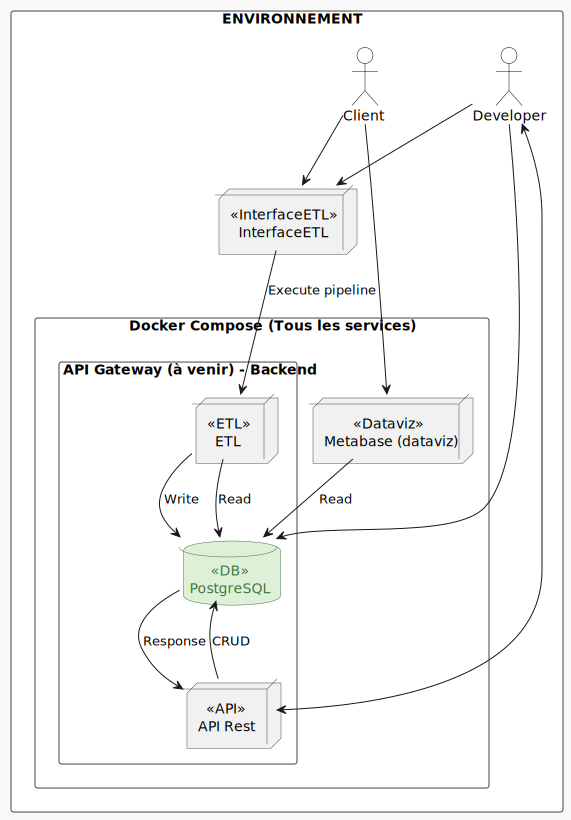

# EPSI B3 MSPRs

Voici le repository de notre groupe pour les MSPRs de la formation EPSI B3 en DEVIA et Data Science (Fullstack + DevOps).

Contributeurs :

1. Samuel RESSIOT
2. Tom WILK-RAVOUX
3. Alexandre PIERRE
4. Maxime DUSSORT

---

## **Navigation dans la Documentation**

- [➡️ Documentation API Rest](apps/api/README.md)
- [➡️ Documentation ETL](apps/etl/README.md)
- [➡️ Documentation Merise](docs/diagrams/merise/merise.md)
- [➡️ Documentation Architecture](docs/architecture/architecture.md)
- ➡️ Documentation IA (MSPR à venir)

## **📜 Architecture logicielle du projet**  

### **1️⃣ Architecture générale**



## **📜 Liste des technologies du projet**  

### **1️⃣ API REST FastAPI**  

| Technologie | Version | Raison du choix | Usage |
|-------------|---------|-----------------|-------|
| **FastAPI** | Latest | Performant, async natif, doc automatique | API REST |
| **Python** | 3.11+ | Langage flexible et puissant | Dev de l'API et de l'IA |
| **SQLAlchemy** | Latest | ORM puissant et compatible avec PostgreSQL | Gestion de la base de données |
| **Pydantic** | Latest | Validation et sérialisation des données | Modèles de données |
| **Gunicorn / Uvicorn** | Latest | Serveur WSGI/ASGI performant | Déploiement de l'API |
| **Dependency Injector** | Latest | Injection de dépendances | Gestion des dépendances |
| **Alembic** | Latest | Migrations de schéma | Gestion des migrations de la base de données |
| **PostgreSQL** | Latest | Base de données relationnelle | Stockage des données |
| **Docker** | Latest | Conteneurisation | Isolation et portabilité |
| **Docker Compose** | Latest | Gestion multi-conteneurs | Environnements Dev & Prod |

---

### **2️⃣ Data visualisation (Metabase)**  

| Technologie | Version | Raison du choix | Usage |
|-------------|---------|-----------------|-------|
| **Metabase** | Latest | Open source | Data visualisation |
| **PostgreSQL** | Latest | Base de données relationnelle | Stockage des données |
| **Docker** | Latest | Conteneurisation | Isolation et portabilité |
| **Docker Compose** | Latest | Gestion multi-conteneurs | Environnements Dev & Prod |

---

### **3️⃣ ETL (Traitement et nettoyage des données en FastAPI)**  

| Technologie | Version | Raison du choix | Usage |
|-------------|---------|-----------------|-------|
| **Pandas** | Latest | Manipulation des données | Nettoyage et transformation des données |
| **TKinter**| Latest | Bibliothèque standard pour les interfaces graphiques en Python | Interface graphique et la sélection de fichiers |

---

### **4️⃣ Infrastructure & DevOps**  

| Technologie | Version | Raison du choix | Usage |
|-------------|---------|-----------------|-------|
| **Docker** | Latest | Conteneurisation | Isolation et portabilité |
| **Docker Compose** | Latest | Gestion multi-conteneurs | Environnements Dev & Prod |
| **CircleCI** | Latest | CI gratuit | Intégration continue |
| **Vercel** | Latest | Déploiement gratuit | Déploiement de l'API |

---

### **5️⃣ Observabilité et Monitoring (à venir)**  

| Technologie | Version | Raison du choix | Usage |
|-------------|---------|-----------------|-------|
| **Prometheus** | Latest | Monitoring des métriques | Supervision des services |
| **Grafana** | Latest | Visualisation des métriques | Tableaux de bord et alertes |
| **ELK Stack (Elasticsearch, Logstash, Kibana)** | Latest | Centralisation et analyse des logs | Gestion des logs backend et frontend |

---

### **6️⃣ Sécurité (à venir)**  

| Technologie | Version | Raison du choix | Usage |
|-------------|---------|-----------------|-------|
| **OAuth2 / JWT / Keyclock** | Latest | Authentification sécurisée | API et utilisateurs |
| **Vault** | Latest | Gestion des secrets | Stockage des clés et credentials |
| **Fail2Ban** | Latest | Protection contre les attaques | Sécurisation des serveurs |

## **Workflow de Développement**

### **Branches de Développement**

- **`develop` (Environnement de développement)** :
  - Protégée contre les pushs directs.
  - Merge accepté uniquement avec des branches de `feature/`, `bugfix/`, ou `hotfix/`.
  - Pull requests non obligatoires pour accélérer le développement.
  - Pipeline CI/CD adaptée pour le développement (à intégrer).

- **`test` (Environnement de test)** :
  - Protégée contre les pushs directs.
  - Merge impossible sans pull request depuis `develop`.
  - Pull requests obligatoires pour garantir la qualité avant la mise en environnemnt de test.
  - Pipeline CI/CD adaptée pour l'intégration des tests (à intégrer).

- **`release/MSPR-{tag}` (Préparation de la version)** :
  - Protégée contre les pushs directs.
  - Merge impossible sans pull request depuis `test`.
  - Pull requests obligatoires pour garantir la qualité avant la mise en production.
  - Pipeline CI adaptée pour l'intégration (à intégrer).

- **`main` (Environnement de production)** :
  - Protégée contre les pushs directs.
  - Merge impossible sans pull request depuis `release` ou `hotfix`.
  - Pull requests obligatoires pour assurer la stabilité et la qualité.
  - Pipeline CI/CD adaptée pour la production (à intégrer).

- **`feature/MSPR-{code_projet}_nom_de_la_branche` (Nouvelle fonctionnalité)** :
  - Aucune protection spécifique.
  - Pipeline CI adaptée pour la branche (à intégrer).
  - Merge possible en `develop` après validation.

- **`bugfix/MSPR-{code_projet}_nom_de_la_branche` (Correction de bug)** :
  - Aucune protection spécifique.
  - Pipeline CI adaptée pour la branche (à intégrer).
  - Merge possible en `develop` après validation.

- **`hotfix/MSPR-{code_projet}_nom_de_la_branche` (Correction critique)** :
  - Aucune protection spécifique.
  - Pipeline CI adaptée pour la branche (à intégrer).
  - Merge possible en `develop` et `main` après validation.
  - Pull request obligatoire pour `main`.

### **Schéma :**


## Installation

### 1. **Clonage du projet**  

Pour cloner le dépôt principal pour la première fois, exécutez :

```bash
git clone https://github.com/Sam-rst/EPSI_B3_MSPR-Groupe_MATS.git
cd EPSI_B3_MSPR-Groupe_MATS
```

### 2. **Initialisation de l'environnement**

Bien penser à créer un fichier `.env` à la racine du projet avec les variables d'environnement nécessaires.

```bash
cp config/env/dev.conf .env
```

Note : Insérer vos credentials dans le fichier `.env`.

Pour initialiser l'environnement de développement, exécutez :

```bash
docker-compose up --build -d
```

Pour regarder les logs d'un container, exécutez :

```bash
docker logs -f MSPR-ETL
```

Pour rentrer dans un container, exécutez :

```bash
docker exec -it <container> /bin/bash
```

Pour effectuer tous les tests dans le container :

```bash
python -m unittest discover -f tests -v
```

---
