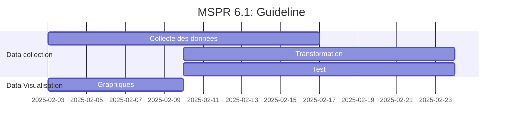

# EPSI B3 MSPRs

Voici le repository de notre groupe pour les MSPRs de la formation EPSI B3 en DEVIA et Data Science (Fullstack et DevOps :).

Contributeurs :

1. Samuel L. JACKSON
2. Tom JEDUSOR
3. Maximus ALBERTUS
4. Alexandre LE GRAND

## Guidelines



---

## **📜 Liste des technologies du projet**  

### **1️⃣ Backend (API FastAPI pour l'IA et autres services)**  

| Technologie | Version | Raison du choix | Usage |
|-------------|---------|-----------------|-------|
| **FastAPI** | Latest | Performant, async natif, doc automatique | API REST |
| **Python** | 3.11+ | Langage flexible et puissant | Dev de l’API et de l’IA |
| **SQLAlchemy** | Latest | ORM puissant et compatible avec PostgreSQL | Gestion de la base de données |
| **Pydantic** | Latest | Validation et sérialisation des données | Modèles de données |
| **Celery** | Latest | Gestion des tâches asynchrones | Traitements en arrière-plan |
| **Redis** | Latest | Caching et gestion des files de tâches | Optimisation des performances |
| **PostgreSQL** | 15+ | Performant et robuste pour les données relationnelles | Base de données principale |
| **Docker** | Latest | Conteneurisation pour déploiement | Exécution en environnement isolé |
| **Gunicorn / Uvicorn** | Latest | Serveur WSGI/ASGI performant | Déploiement de l’API |
| **OAuth2 / JWT** | Latest | Sécurité et authentification | Gestion des utilisateurs et des permissions |

---

### **2️⃣ Frontend (Application Angular)**  

| Technologie | Version | Raison du choix | Usage |
|-------------|---------|-----------------|-------|
| **Angular** | Latest | Framework robuste et maintenable | Développement du frontend |
| **TypeScript** | Latest | Typage fort, maintenabilité | Langage principal |
| **RxJS** | Latest | Gestion des événements et requêtes async | Communication API |
| **TailwindCSS** | Latest | Styling moderne et flexible | UI et mise en page |
| **Angular Material** | Latest | Composants UI préconstruits | UI cohérente et ergonomique |
| **NGXS ou Redux** | Latest | Gestion centralisée du state | State management |

---

### **3️⃣ ETL (Traitement et nettoyage des données)**  

| Technologie | Version | Raison du choix | Usage |
|-------------|---------|-----------------|-------|
| **Apache Airflow** | Latest | Orchestration des workflows ETL | Planification des tâches |
| **Pandas** | Latest | Manipulation des données | Nettoyage et transformation des données |
| **DuckDB** | Latest | Traitement performant des datasets volumineux | Analyse et transformation |
| **SQLAlchemy** | Latest | ORM pour interagir avec les bases | Stockage des données transformées |
| **S3 / MinIO** | Latest | Stockage de fichiers volumineux | Archivage des données brutes |

---

### **4️⃣ Infrastructure & DevOps**  

| Technologie | Version | Raison du choix | Usage |
|-------------|---------|-----------------|-------|
| **Docker** | Latest | Conteneurisation | Isolation et portabilité |
| **Docker Compose** | Latest | Gestion multi-conteneurs | Environnements Dev & Prod |
| **Kubernetes (K8s)** | Optional | Scalabilité et orchestration | Gestion des déploiements |
| **Terraform** | Latest | Infrastructure as Code | Automatisation du déploiement |
| **Ansible** | Latest | Configuration automatisée | Provisioning des serveurs |
| **NGINX / Traefik** | Latest | Proxy et Load Balancer | Redirection et gestion des requêtes |
| **Certbot (Let's Encrypt)** | Latest | Sécurisation HTTPS | Certificats SSL gratuits |

---

### **5️⃣ Observabilité et Monitoring**  

| Technologie | Version | Raison du choix | Usage |
|-------------|---------|-----------------|-------|
| **Prometheus** | Latest | Monitoring des métriques | Supervision des services |
| **Grafana** | Latest | Visualisation des métriques | Tableaux de bord et alertes |
| **ELK Stack (Elasticsearch, Logstash, Kibana)** | Latest | Centralisation et analyse des logs | Gestion des logs backend et frontend |

---

### **6️⃣ Sécurité**  

| Technologie | Version | Raison du choix | Usage |
|-------------|---------|-----------------|-------|
| **OAuth2 / JWT** | Latest | Authentification sécurisée | API et utilisateurs |
| **Vault** | Latest | Gestion des secrets | Stockage des clés et credentials |
| **Fail2Ban** | Latest | Protection contre les attaques | Sécurisation des serveurs |

## Installation

Pour que les submodules Git soient bien initialisés et clonés automatiquement, voici les étapes à suivre :  

### 1. **Clonage avec les submodules**  

Pour cloner le dépôt principal pour la première fois, exécutez :

```bash
git clone --recurse-submodules https://github.com/Sam-rst/EPSI_B3_MSPR-Groupe_MATS.git
```

Cela va cloner le dépôt principal **et** initialiser directement les submodules.

---

### 2. **Mise à jour des submodules après un simple `git clone`**  

Si vous n'avez pas cloné le dépôt **sans** l'option `--recurse-submodules`, les submodules ne seront pas récupérés immédiatement. Pour les récupérer et les mettre à jour, il faut exécuter :  

```bash
cd EPSI_B3_MSPR-Groupe_MATS
git submodule update --init --recursive
```

---

### 3. **Mettre à jour les submodules**  

Les submodules ne se mettent pas à jour automatiquement quand le dépôt principal change. Si un submodule a été mis à jour dans son propre dépôt, exécutez :  

```bash
git submodule update --remote --recursive
```

Cela récupère les dernières versions des branches des submodules.

## UML

1. Diagramme de classes ([lien](docs/UML/class-diagram.md))

2. Diagramme de séquence ([lien](docs/UML/sequence-diagram.md))

3. Diagramme d'état ([lien](docs/UML/state-diagram.md))
