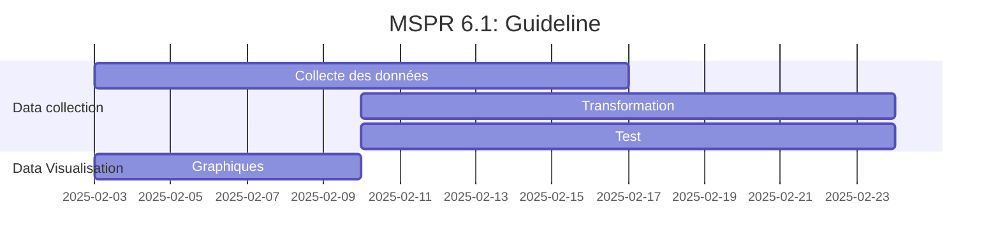

# EPSI B3 MSPRs

Voici le repository de notre groupe pour les MSPRs de la formation EPSI B3 en DEVIA et Data Science (Fullstack et DevOps :).

Contributeurs :

1. Samuel L. JACKSON
2. Tom JEDUSOR
3. Maximus ALBERTUS
4. Alexandre LE GRAND

## Guidelines

## UML

1. Diagramme de classes ([lien](docs/UML/class-diagram.md))

2. Diagramme de séquence ([lien](docs/UML/sequence-diagram.md))

3. Diagramme d'état ([lien](docs/UML/state-diagram.md))