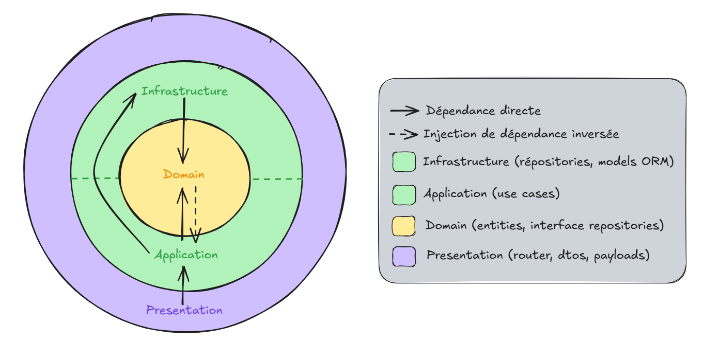

# 🏗️ Documentation de l'Architecture de l'Application API

[⬅️ Retour](../../README.md)

Documentation rédigée par Samuel RESSIOT

---

## 📝 Introduction

Cette documentation a pour objectif de fournir une vue d'ensemble claire et détaillée de l'architecture de l'application API. Elle est destinée aux développeurs souhaitant comprendre la structure du projet, ses principes de conception, et les responsabilités de chaque couche. L'architecture est conçue pour être **modulaire**, **maintenable** et **évolutive**, en suivant les bonnes pratiques de développement logiciel.

---

## 📊 Diagramme de l'Architecture

Voici un diagramme simplifié illustrant les interactions entre les différentes couches :

---

## 🏗️ Vue d'Ensemble de l'Architecture

L'application est organisée en **quatre couches principales**, chacune ayant une responsabilité spécifique. Cette séparation garantit une meilleure maintenabilité et testabilité du code.

### **Principes Clés**

1. **Modularité** : Chaque fonctionnalité (par exemple, gestion des continents, des pays, des vaccins) est isolée dans un module.
2. **Séparation des Couches** :
   - **Présentation** : Gère les interactions avec les utilisateurs via des routes HTTP.
   - **Application** : Contient les cas d'utilisation (use cases) qui orchestrent la logique métier.
   - **Domaine** : Définit les entités métier et les interfaces des repositories.
   - **Infrastructure** : Gère les interactions avec les systèmes externes (base de données, API, etc.).
3. **Injection de Dépendances** : Les composants sont connectés via un conteneur d'injection de dépendances pour faciliter les tests et la flexibilité.

---

## 📂 Structure des Couches

### 1️⃣ **Couche Présentation**

- **🎯 Rôle** : Gérer les requêtes HTTP, valider les données entrantes et retourner les réponses appropriées.
- **📌 Responsabilités** :
  - Définir les routes HTTP.
  - Valider les données entrantes à l'aide de modèles Pydantic.
  - Appeler les cas d'utilisation (use cases) de la couche application.
- **💡 Exemple** : Les routes HTTP sont définies dans des modules comme `continent`, `country`, et `vaccine`.
- **🛠️ Technologie utilisée** : [FastAPI](https://fastapi.tiangolo.com/).

---

### 2️⃣ **Couche Application**

- **🎯 Rôle** : Orchestrer la logique métier via des cas d'utilisation (use cases).
- **📌 Responsabilités** :
  - Implémenter les cas d'utilisation spécifiques à chaque fonctionnalité.
  - Coordonner les interactions entre la couche présentation et la couche domaine.
- **💡 Exemple** :
  - `AddVaccineUseCase` : Ajoute un nouveau vaccin.
  - `FindAllVaccinesUseCase` : Récupère tous les vaccins.
- **❓ Pourquoi c'est important** : Cette couche agit comme un intermédiaire entre la présentation et le domaine, en s'assurant que la logique métier est correctement appliquée.

---

### 3️⃣ **Couche Domaine**

- **🎯 Rôle** : Définir les entités métier et les interfaces des repositories.
- **📌 Responsabilités** :
  - Encapsuler les règles métier dans des entités.
  - Fournir des interfaces pour les repositories, garantissant une abstraction des implémentations spécifiques.
- **💡 Exemple** :
  - `Vaccine` : Une entité représentant un vaccin.
  - `VaccineRepository` : Interface définissant les méthodes pour interagir avec les données des vaccins.
- **❓ Pourquoi c'est important** : Cette couche est indépendante des technologies utilisées, ce qui la rend facile à tester et à maintenir.

---

### 4️⃣ **Couche Infrastructure**

- **🎯 Rôle** : Gérer les interactions avec les systèmes externes comme la base de données ou les API tierces.
- **📌 Responsabilités** :
  - Implémenter les repositories définis dans la couche domaine.
  - Gérer la persistance des données et les interactions avec les systèmes externes.
- **💡 Exemple** :
  - `VaccineRepositoryInPostgres` : Implémentation pour PostgreSQL.
  - `VaccineRepositoryInMemory` : Implémentation en mémoire pour les tests.
- **🛠️ Technologies utilisées** :
  - [SQLAlchemy](https://www.sqlalchemy.org/) pour la gestion des bases de données.
  - [Alembic](https://alembic.sqlalchemy.org/) pour les migrations.

---

## 🛠️ Principes de Conception

1. **Séparation des Responsabilités** : Chaque couche a une responsabilité bien définie, ce qui facilite la maintenance et l'évolution du code.
2. **Indépendance des Couches** : Les couches supérieures (présentation, application) ne dépendent pas des implémentations spécifiques des couches inférieures (infrastructure).
3. **Testabilité** : Grâce à l'injection de dépendances et à l'abstraction des interfaces, chaque couche peut être testée indépendamment.

---

## 🔄 Exemple de Flux de Données

1. **Requête Entrante** : Un utilisateur envoie une requête HTTP via une route définie dans la couche présentation.
2. **Validation** : Les données de la requête sont validées à l'aide de modèles Pydantic.
3. **Cas d'Utilisation** : La couche présentation appelle un use case dans la couche application.
4. **Logique Métier** : Le use case interagit avec les entités et les interfaces définies dans la couche domaine.
5. **Persistance** : Si nécessaire, le use case utilise un repository implémenté dans la couche infrastructure pour interagir avec la base de données.
6. **Réponse** : Une réponse est renvoyée à l'utilisateur via la couche présentation.

---

## 🎉 Conclusion

Cette architecture modulaire et découplée permet de développer une application robuste, maintenable et évolutive. En suivant les principes décrits dans cette documentation, les développeurs peuvent facilement ajouter de nouvelles fonctionnalités, corriger des bugs ou améliorer les performances sans compromettre la stabilité du système.
