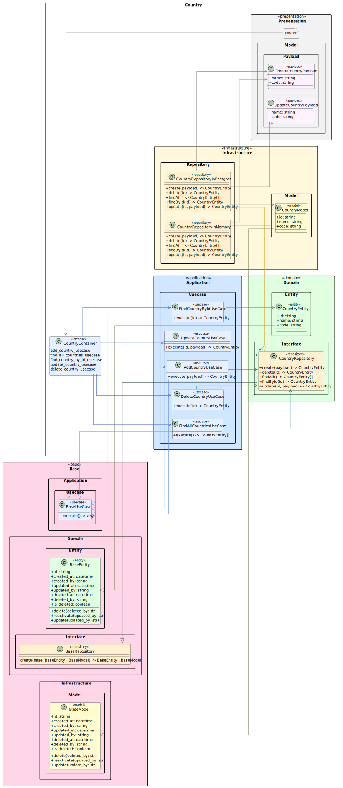

# 🌍 Diagramme de Classe - Fonctionnement du Module Country

[⬅️ Retour](../../../../README.md)

Documentation rédigée par Samuel RESSIOT

---

## 📝 Introduction

Bienvenue dans la documentation du module **Country** ! Ce document vous guidera à travers les principales classes, leurs responsabilités, et leurs relations. Vous trouverez également un aperçu visuel pour mieux comprendre l'architecture.

---

## 📊 Aperçu Visuel

Voici une représentation visuelle du diagramme de classe. Cliquez sur l'image pour l'agrandir si nécessaire :

---

## 🗂️ Structure du Module

### 1. **CountryContainer**

La classe `CountryContainer` est le cœur du module. Elle gère les dépendances et configure les repositories ainsi que les cas d'utilisation (use cases).

#### **Attributs**

- **`modules: list`** : Liste des modules liés à la présentation.
- **`config: Config`** : Configuration de l'application.
- **`repository_in_memory: CountryRepositoryInMemory`** : Repository en mémoire pour les pays.
- **`repository_in_postgres: CountryRepositoryInPostgres`** : Repository PostgreSQL pour les pays.
- **`continent_repository_in_memory: ContinentRepositoryInMemory`** : Repository en mémoire pour les continents.
- **`continent_repository_in_postgres: ContinentRepositoryInPostgres`** : Repository PostgreSQL pour les continents.
- **`repository: CountryRepositoryInterface`** : Repository sélectionné en fonction de la configuration.
- **`continent_repository: ContinentRepositoryInterface`** : Repository des continents sélectionné en fonction de la configuration.

#### **Méthodes**

- **`add_country_usecase: AddCountryUseCase`** : Cas d'utilisation pour ajouter un pays.
- **`find_all_countries_usecase: FindAllCountriesUseCase`** : Cas d'utilisation pour récupérer tous les pays.
- **`find_country_by_id_usecase: FindCountryByIdUseCase`** : Cas d'utilisation pour récupérer un pays par son ID.
- **`update_country_usecase: UpdateCountryUseCase`** : Cas d'utilisation pour mettre à jour un pays.
- **`delete_country_usecase: DeleteCountryUseCase`** : Cas d'utilisation pour supprimer un pays.

---

### 2. **Use Cases**

Les cas d'utilisation définissent les actions principales que l'application peut effectuer.

#### **AddCountryUseCase**

- **Méthode** : `+execute(payload) -> CountryEntity`
- **Description** : Ajoute un nouveau pays.

#### **DeleteCountryUseCase**

- **Méthode** : `+execute(id) -> CountryEntity`
- **Description** : Supprime un pays par son ID.

#### **FindAllCountriesUseCase**

- **Méthode** : `+execute() -> CountryEntity[]`
- **Description** : Récupère tous les pays.

#### **FindCountryByIdUseCase**

- **Méthode** : `+execute(id) -> CountryEntity`
- **Description** : Récupère un pays par son ID.

#### **UpdateCountryUseCase**

- **Méthode** : `+execute(id, payload) -> CountryEntity`
- **Description** : Met à jour un pays.

---

### 3. **Domain Layer**

La couche domaine contient les entités et les interfaces qui définissent les règles métier.

#### **CountryEntity**

- **Attributs** :
  - `+id: string` : Identifiant unique du pays.
  - `+name: string` : Nom du pays.
  - `+code: string` : Code ISO du pays.

#### **CountryRepositoryInterface**

- **Méthodes** :
  - `+create(payload) -> CountryEntity` : Crée un pays.
  - `+delete(id) -> CountryEntity` : Supprime un pays.
  - `+findAll() -> CountryEntity[]` : Récupère tous les pays.
  - `+findById(id) -> CountryEntity` : Récupère un pays par son ID.
  - `+update(id, payload) -> CountryEntity` : Met à jour un pays.

---

### 4. **Infrastructure Layer**

La couche infrastructure contient les modèles de données et les implémentations des repositories.

#### **CountryModel**

- **Attributs** :
  - `+id: string` : Identifiant unique du pays.
  - `+name: string` : Nom du pays.
  - `+code: string` : Code ISO du pays.

#### **CountryRepositoryInMemory**

- **Méthodes** :
  - `+create(payload) -> CountryEntity` : Crée un pays en mémoire.
  - `+delete(id) -> CountryEntity` : Supprime un pays en mémoire.
  - `+findAll() -> CountryEntity[]` : Récupère tous les pays en mémoire.
  - `+findById(id) -> CountryEntity` : Récupère un pays en mémoire par son ID.
  - `+update(id, payload) -> CountryEntity` : Met à jour un pays en mémoire.

#### **CountryRepositoryInPostgres**

- **Méthodes** :
  - `+create(payload) -> CountryEntity` : Crée un pays dans PostgreSQL.
  - `+delete(id) -> CountryEntity` : Supprime un pays dans PostgreSQL.
  - `+findAll() -> CountryEntity[]` : Récupère tous les pays dans PostgreSQL.
  - `+findById(id) -> CountryEntity` : Récupère un pays dans PostgreSQL par son ID.
  - `+update(id, payload) -> CountryEntity` : Met à jour un pays dans PostgreSQL.

---

### 5. **Presentation Layer**

La couche présentation contient les modèles de données et les routes.

#### **CreateCountryPayload**

- **Attributs** :
  - `+name: string` : Nom du pays.
  - `+code: string` : Code ISO du pays.

#### **UpdateCountryPayload**

- **Attributs** :
  - `+name: string` : Nom du pays.
  - `+code: string` : Code ISO du pays.

---
