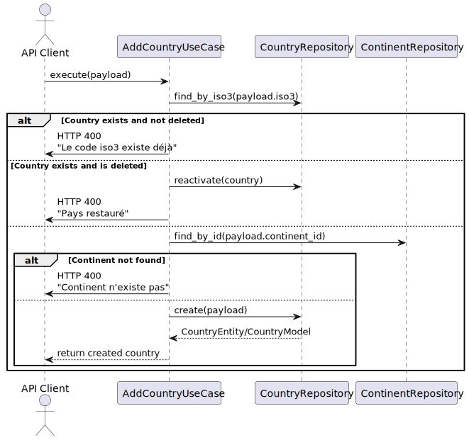

# 🌍 AddCountryUseCase - Cas d'Utilisation

[⬅️ Retour](../../../../README.md)

Documentation rédigée par Samuel RESSIOT

---

## 📝 Introduction

Ce document explique le fonctionnement métier du cas d'utilisation **AddCountryUseCase**, qui permet d'ajouter un nouveau pays dans le système tout en respectant les règles métier définies.

---

## 🎯 Objectif

L'objectif principal de ce cas d'utilisation est de permettre l'ajout d'un pays dans le système tout en garantissant :

- L'unicité du code ISO3 pour chaque pays.
- La validation de l'existence du continent associé.
- La réactivation d'un pays supprimé si nécessaire.

---

## 🖼️ Diagramme de Séquence

Voici le diagramme de séquence illustrant le fonctionnement de ce cas d'utilisation :



---

## 🛠️ Fonctionnement Métier

### 1️⃣ **Vérification de l'existence du pays**

- Le système vérifie si un pays avec le même code ISO3 existe déjà dans la base de données.
- **Scénarios possibles** :
  - **Le pays existe et n'est pas supprimé** : Une erreur est renvoyée avec le message : `"Le code iso3 existe déjà"`.
  - **Le pays existe mais est supprimé** : Le pays est réactivé et une réponse est renvoyée avec le message : `"Pays restauré"`.

### 2️⃣ **Validation du continent**

- Si le pays n'existe pas, le système vérifie si le continent associé (via `continent_id`) existe dans la base de données.
- **Scénarios possibles** :
  - **Le continent n'existe pas** : Une erreur est renvoyée avec le message : `"Continent n'existe pas"`.
  - **Le continent existe** : Le processus continue.

### 3️⃣ **Création du pays**

- Si toutes les validations sont réussies, le système crée un nouveau pays avec les informations fournies dans le payload.
- Une réponse contenant les détails du pays créé est renvoyée.

---

## 🔄 Cycle de Vie du Use Case

Voici un résumé des étapes du cycle de vie de ce cas d'utilisation :

1. **Entrée** : Le client envoie une requête avec un payload contenant les informations du pays à ajouter.
2. **Traitement** :
   - Vérification de l'existence du pays.
   - Validation de l'existence du continent.
   - Création ou réactivation du pays.
3. **Sortie** : Une réponse est renvoyée au client, contenant soit les détails du pays créé, soit un message d'erreur.

---

## 📋 Règles Métier

1. **Unicité du code ISO3** : Chaque pays doit avoir un code ISO3 unique dans le système.
2. **Validation du continent** : Un pays ne peut être associé qu'à un continent existant.
3. **Réactivation des pays supprimés** : Si un pays supprimé est ajouté à nouveau, il est réactivé au lieu d'être recréé.

---

## 📦 Exemple de Payload

Voici un exemple de payload attendu pour ce cas d'utilisation :

```json
{
  "name": "France",
  "iso2": "FR",
  "iso3": "FRA",
  "population": 67000000,
  "continent_id": 1
}
```

---

## 🛑 Gestion des Erreurs

### Erreurs possibles et leurs significations

1. **Code ISO3 déjà existant** :
   - **Message** : `"Le code iso3 existe déjà"`
   - **Cause** : Un pays avec le même code ISO3 existe déjà et n'est pas supprimé.

2. **Pays supprimé réactivé** :
   - **Message** : `"Pays restauré"`
   - **Cause** : Un pays avec le même code ISO3 existe mais est marqué comme supprimé.

3. **Continent inexistant** :
   - **Message** : `"Continent n'existe pas"`
   - **Cause** : Le `continent_id` fourni ne correspond à aucun continent dans la base de données.

---

## 📝 Notes pour les Développeurs

- **Classe associée** : `AddCountryUseCase`
- **Méthode principale** : `execute(payload)`
- **Dépendances** :
  - `CountryRepository` : Pour gérer les opérations sur les pays.
  - `ContinentRepository` : Pour valider l'existence des continents.

---

## 🎉 Conclusion

Le cas d'utilisation **AddCountryUseCase** est conçu pour garantir l'intégrité des données tout en offrant une expérience utilisateur fluide. Si vous avez des questions ou des suggestions, n'hésitez pas à les partager avec l'équipe !
