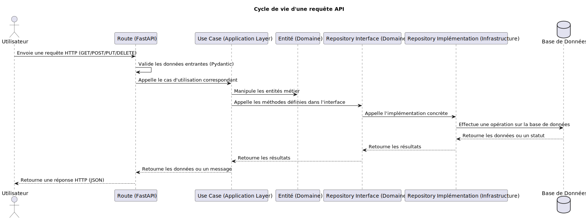

# 📜 Cycle de Vie d'une Requête API

[⬅️ Retour](../../../../README.md)

Documentation rédigée par Samuel RESSIOT

---

## 📝 Introduction

Cette documentation détaille le cycle de vie complet d'une requête API dans l'application. Elle explique les interactions entre les différentes couches de l'architecture et les composants impliqués, depuis la réception de la requête jusqu'à la réponse envoyée à l'utilisateur.

---

## 📊 Diagramme de Séquence

Voici un diagramme de séquence illustrant le cycle de vie d'une requête API :

---

## 🏗️ Étapes du Cycle de Vie

### 1️⃣ **Requête Entrante**

- **Acteur** : Utilisateur ou client (ex. : navigateur, application mobile).
- **Action** : Envoie une requête HTTP (GET, POST, PUT, DELETE) à un endpoint défini dans l'API.
- **Exemple** : `GET /api/v1/vaccines`.

---

### 2️⃣ **Couche Présentation**

- **Composant** : Route définie dans FastAPI.
- **Action** :
  - Valide les données entrantes à l'aide de modèles Pydantic.
  - Identifie l'endpoint correspondant à la requête.
  - Appelle le cas d'utilisation (use case) approprié dans la couche application.
- **Exemple** : La route `/api/v1/vaccines` appelle le use case `FindAllVaccinesUseCase`.

---

### 3️⃣ **Couche Application**

- **Composant** : Use case.
- **Action** :
  - Orchestration de la logique métier.
  - Appelle les entités et les interfaces définies dans la couche domaine.
  - Gère les exceptions et les erreurs éventuelles.
- **Exemple** : `FindAllVaccinesUseCase` interagit avec l'interface `VaccineRepository`.

---

### 4️⃣ **Couche Domaine**

- **Composants** :
  - Entités métier (ex. : `Vaccine`).
  - Interfaces des repositories (ex. : `VaccineRepository`).
- **Action** :
  - Applique les règles métier.
  - Fournit une abstraction pour les interactions avec les données.
- **Exemple** : L'interface `VaccineRepository` est appelée pour récupérer les données des vaccins.

---

### 5️⃣ **Couche Infrastructure**

- **Composant** : Implémentation concrète du repository.
- **Action** :
  - Interagit avec la base de données ou d'autres systèmes externes.
  - Exécute les requêtes SQL ou les appels API nécessaires.
- **Exemple** : `VaccineRepositoryInPostgres` exécute une requête SQL pour récupérer les vaccins depuis PostgreSQL.

---

### 6️⃣ **Base de Données**

- **Composant** : PostgreSQL (ou autre système de stockage).
- **Action** :
  - Exécute les opérations CRUD (Create, Read, Update, Delete).
  - Retourne les résultats au repository.
- **Exemple** : La requête SQL `SELECT * FROM vaccines` retourne une liste de vaccins.

---

### 7️⃣ **Retour des Données**

- **Flux** :
  1. Les données sont retournées du repository (infrastructure) à l'interface (domaine).
  2. L'interface retourne les données au use case (application).
  3. Le use case retourne les données à la route (présentation).
  4. La route formate les données en JSON et les retourne à l'utilisateur.
- **Exemple** : Une liste de vaccins est renvoyée sous forme de réponse HTTP JSON.

---

## 🔄 Résumé du Flux

1. **Utilisateur** : Envoie une requête HTTP.
2. **Route (FastAPI)** : Valide et redirige la requête vers le use case.
3. **Use Case** : Orchestration de la logique métier.
4. **Entités et Interfaces** : Applique les règles métier et interagit avec les repositories.
5. **Repository** : Interagit avec la base de données.
6. **Base de Données** : Exécute les opérations nécessaires.
7. **Réponse** : Retourne les données ou un message à l'utilisateur.

---

## 🎉 Conclusion

Ce cycle de vie garantit une séparation claire des responsabilités entre les couches, rendant l'application modulaire, maintenable et testable. En suivant ce flux, les développeurs peuvent facilement comprendre et étendre les fonctionnalités de l'API.
