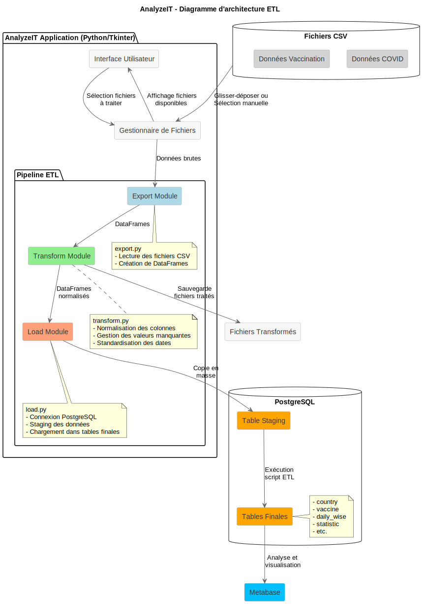

# Analyze IT - Solution ETL

<p align="center">
  <a href="#aperçu">Aperçu</a> •
  <a href="#fonctionnalités">Fonctionnalités</a> •
  <a href="#installation">Installation</a> •
  <a href="#utilisation">Utilisation</a> •
  <a href="#architecture">Architecture</a> •
  <a href="#documentation-technique">Documentation Technique</a> •
</p>

## Aperçu

Analyze IT est une application ETL (Extract, Transform, Load) développée pour standardiser et nettoyer les données épidémiologiques provenant de diverses sources. Face à l'hétérogénéité des formats et conventions utilisés pour publier les données COVID-19, cette solution facilite l'intégration et l'analyse en proposant un pipeline complet de traitement.

## Fonctionnalités

- ✨ **Interface graphique intuitive** avec support du glisser-déposer
- 📥 **Extraction** de données depuis plusieurs fichiers CSV
- 🔄 **Transformation** avec standardisation des noms de colonnes, formats de dates et noms de pays
- 🧹 **Nettoyage** intelligent des valeurs manquantes selon le type de données
- 📤 **Export** des données nettoyées au format CSV
- 💾 **Chargement** dans une base de données PostgreSQL
- ⚙️ **Configuration flexible** via un système de mapping YAML

## Installation

### Prérequis

- Python 3.10+
- Docker
- DBeaver ou PGAdmin

### Installation standard

```bash

# Installer les dépendances
pip install -r requirements.txt
```
## Documentation Technique

https://www.canva.com/design/DAGj5AJliDw/FhhWY4X7QrvmJrBGfVMY1w/edit?utm_content=DAGj5AJliDw&utm_campaign=designshare&utm_medium=link2&utm_source=sharebutton


