# Architecture du Projet

## Introduction
Une brève introduction qui explique l'objectif du document et donne un aperçu général de l'architecture.

## Vue d'ensemble
Une description générale de l'architecture.

## Composants
Détaillez les différents composants du système.

## Flux de Données
Expliquez comment les données circulent à travers le système.

## Technologies Utilisées
Listez les technologies et outils utilisés.

## Diagrammes
Incluez des diagrammes pour illustrer l'architecture.

```mermaid
graph TD;
    A[Client] --> B[Serveur];
    B --> C[Base de Données];
```



## Exemples de Code
Incluez des extraits de code pour illustrer des points spécifiques de l'architecture.

## Références et Liens
Ajoutez des liens vers des documents ou des ressources externes pour plus de détails.

## Structure du Projet

```
📦 Mon-Projet 
├── 📂 apps
│   ├── 📂 api             # API REST principale (FastAPI)
│   ├── 📂 auth            # Service d'authentification (Keycloak)
│   ├── 📂 etl             # Pipeline ETL (Airflow + pandas)  
│   ├── 📂 frontend        # Web App (Next)
│   ├── 📂 ia              # API Machine Learning (FastAPI + TensorFlow)
│   ├── 📂 monitoring      # Logs & Stats (Prometheus, Grafana, Loki)
│   ├── 📂 gateway         # API Gateway (KrakenD)
│
├── 📂 infra
│   ├── 📂 db              # PostgreSQL
│   ├── 📂 docker          # Fichiers Docker
│   ├── 📂 krakend          # Fichiers config krakend
│
├── docker-compose.yml     # Configuration des services
```

## Infrastructure

- **Base de données**: PostgreSQL
- **Conteneurisation**: Docker
- **API Gateway**: KrakenD

## Fichier docker-compose.yml

Un exemple de fichier `docker-compose.yml` est fourni pour configurer les services.
