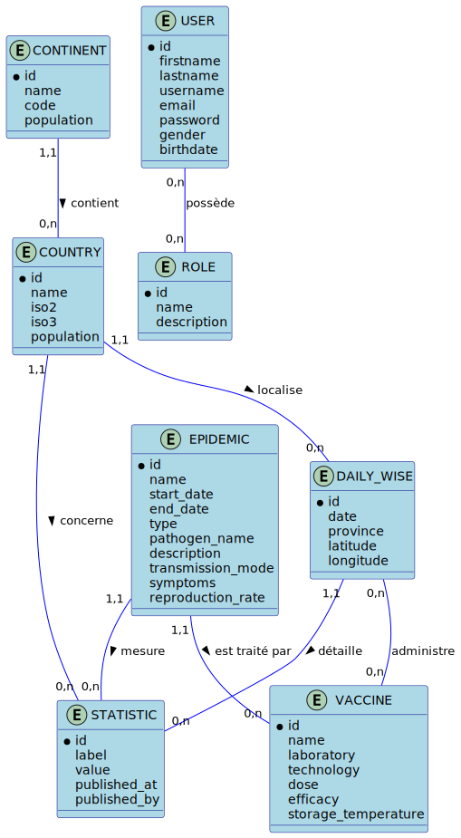
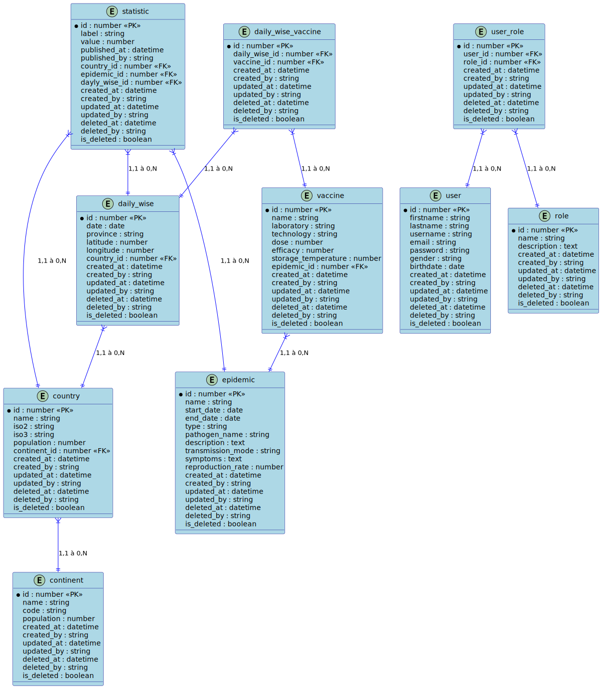

# Documentation Merise

[⬅️ Retour au README.md](/README.md)

Cette documentation présente les modèles conceptuels et logiques de données (MCD et MLD) pour le projet.

---

## Modèle Conceptuel de Données (MCD)

Le **Modèle Conceptuel de Données (MCD)** représente les entités, leurs attributs et les relations entre elles. Il est utilisé pour définir les besoins fonctionnels en termes de données.

### Diagramme MCD



---

## Modèle Logique de Données (MLD)

Le **Modèle Logique de Données (MLD)** est une traduction du MCD en un modèle plus proche de la structure des bases de données relationnelles. Il inclut les clés primaires, les clés étrangères et les cardinalités.

### Diagramme MLD



---

## Fichiers associés

- **MCD** :
  - Fichier source : [`puml/mcd.puml`](puml/mcd.puml)
  - Diagramme généré : [`img/MCD.svg`](img/MCD.svg)
- **MLD** :
  - Fichier source : [`puml/mld.puml`](puml/mld.puml)
  - Diagramme généré : [`img/MLD.svg`](img/MLD.svg)

---

## Instructions pour modifier les diagrammes

1. **Modifier les fichiers source** :
   - Les fichiers source des diagrammes sont écrits en syntaxe PlantUML :
     - [`puml/mcd.puml`](puml/mcd.puml) pour le MCD.
     - [`puml/mld.puml`](puml/mld.puml) pour le MLD.

2. **Générer les diagrammes** :
   - Utilisez un outil comme [PlantUML](https://plantuml.com/) ou une extension dans votre IDE (par exemple, VS Code avec l'extension PlantUML).
   - Commande pour générer les fichiers SVG :
     ```bash
     plantuml -tsvg puml/mcd.puml
     plantuml -tsvg puml/mld.puml
     ```

3. **Mettre à jour les fichiers générés** :
   - Remplacez les fichiers `img/MCD.svg` et `img/MLD.svg` par les nouvelles versions générées.

---

## Références

- [Documentation officielle de PlantUML](https://plantuml.com/)
- [Méthode Merise](https://fr.wikipedia.org/wiki/Merise)