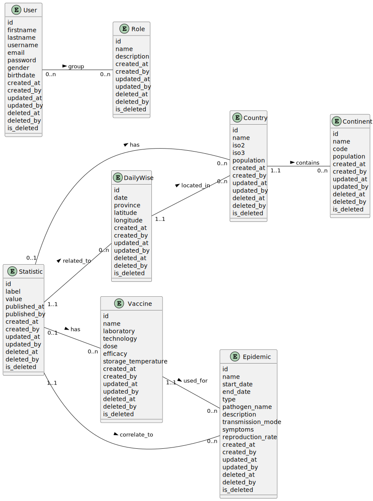
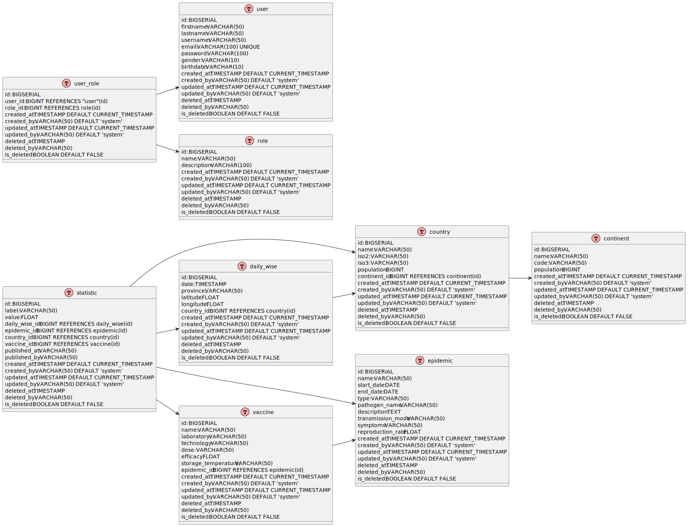

# 📊 Documentation Merise

[⬅️ Retour au README.md](/README.md)

Bienvenue dans la documentation Merise du projet. Ce document présente les modèles conceptuels, logiques et physiques de données (MCD, MLD et MPD) utilisés pour concevoir et structurer la base de données.

---

## 📝 Introduction

La méthode **Merise** est utilisée pour modéliser les données et les traitements d'un système d'information. Elle repose sur trois niveaux de modélisation :

1. **Modèle Conceptuel de Données (MCD)** : Définit les entités, leurs attributs et les relations.
2. **Modèle Logique de Données (MLD)** : Traduit le MCD en un modèle relationnel.
3. **Modèle Physique de Données (MPD)** : Détaille la structure physique de la base de données.

---

## 🧩 Modèle Conceptuel de Données (MCD)

Le **Modèle Conceptuel de Données (MCD)** représente les entités, leurs attributs et les relations entre elles. Il est utilisé pour définir les besoins fonctionnels en termes de données.

### 📌 Diagramme MCD

Voici le diagramme MCD du projet :

---

## 🛠️ Modèle Logique de Données (MLD)

Le **Modèle Logique de Données (MLD)** est une traduction du MCD en un modèle relationnel. Il inclut les clés primaires, les clés étrangères et les cardinalités.

### 📌 Diagramme MLD

Voici le diagramme MLD du projet :

---

## 🗄️ Modèle Physique de Données (MPD)

Le **Modèle Physique de Données (MPD)** détaille la structure physique de la base de données, y compris les types de données, les index et les contraintes. Ce modèle est spécifique au SGBD utilisé (PostgreSQL dans notre cas).

### 📌 Diagramme MPD

Voici le diagramme MPD du projet :

---

## 🛠️ Instructions pour Modifier les Diagrammes

### 1️⃣ Modifier les Fichiers Source

Les fichiers source des diagrammes sont écrits en syntaxe PlantUML :

- [`mcd/mcd.puml`](mcd/mcd.puml) pour le MCD.
- [`mld/mld.puml`](mld/mld.puml) pour le MLD.
- [`mpd/mpd.puml`](mpd/mpd.puml) pour le MPD.

### 2️⃣ Générer les Diagrammes

Utilisez un outil comme [PlantUML](https://plantuml.com/) ou une extension dans votre IDE (par exemple, VS Code avec l'extension PlantUML) pour générer les diagrammes à partir des fichiers `.puml`.

---

## 📚 Références

- [Documentation officielle de PlantUML](https://plantuml.com/)
- [Méthode Merise (Wikipedia)](https://fr.wikipedia.org/wiki/Merise)

---

## 🎉 Conclusion

Cette documentation vous permet de comprendre la structure des données du projet et de contribuer efficacement à son évolution. Si vous avez des questions ou des suggestions, n'hésitez pas à les partager avec l'équipe. 🚀
