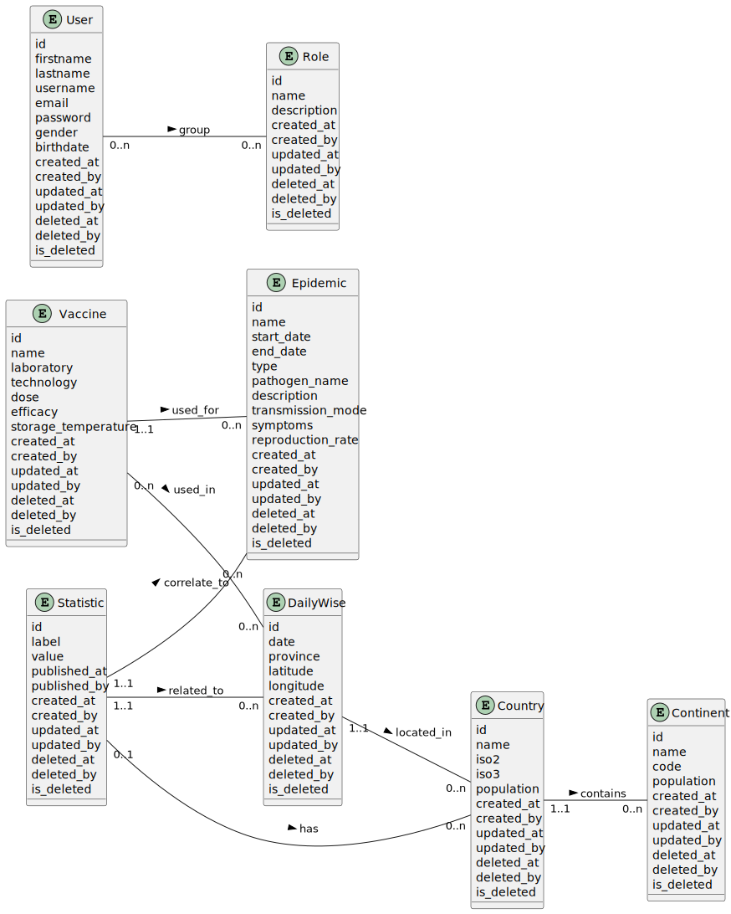

# Documentation Merise

[⬅️ Retour au README.md](/README.md)

Cette documentation présente les modèles conceptuels et logiques de données (MCD et MLD) pour le projet.

---

## Modèle Conceptuel de Données (MCD)

Le **Modèle Conceptuel de Données (MCD)** représente les entités, leurs attributs et les relations entre elles. Il est utilisé pour définir les besoins fonctionnels en termes de données.

### Diagramme MCD

---

## Modèle Logique de Données (MLD)

Le **Modèle Logique de Données (MLD)** est une traduction du MCD en un modèle plus proche de la structure des bases de données relationnelles. Il inclut les clés primaires, les clés étrangères et les cardinalités.

### Diagramme MLD

---

## Modèle Physique de Données (MPD)

Le **Modèle Physique de Données (MPD)** détaille la structure physique de la base de données, y compris les types de données, les index et les contraintes. Il est spécifique à un SGBD (Système de Gestion de Base de Données) particulier.

### Diagramme MPD

---

## Fichiers associés

- **MCD** :
  - Fichier source : [`mcd/mcd.puml`](mcd/mcd.puml)
  - Diagramme généré (en SVG): [`mcd/img/MCD.svg`](mcd/img/MCD.svg)
  - Diagramme généré (en PNG): [`mcd/img/MCD.png`](mcd/img/MCD.png)
- **MLD** :
  - Fichier source : [`mld/mld.puml`](mld/mld.puml)
  - Diagramme généré (en SVG): [`mld/img/MLD.svg`](mld/img/MLD.svg)
  - Diagramme généré (en PNG): [`mld/img/MLD.png`](mld/img/MLD.png)
- **MPD** :
  - Fichier source : [`mpd/mpd.puml`](mpd/mpd.puml)
  - Diagramme généré (en SVG): [`mpd/img/MPD.svg`](mpd/img/MPD.svg)
  - Diagramme généré (en PNG): [`mpd/img/MPD.png`](mpd/img/MPD.png)

---

## Instructions pour modifier les diagrammes

1. **Modifier les fichiers source** :
   - Les fichiers source des diagrammes sont écrits en syntaxe PlantUML :
     - [`mcd/mcd.puml`](mcd/mcd.puml) pour le MCD.
     - [`mld/mld.puml`](mld/mld.puml) pour le MLD.
     - [`mpd/mpd.puml`](mpd/mpd.puml) pour le MPD.

2. **Générer les diagrammes** :
   - Utilisez un outil comme [PlantUML](https://plantuml.com/) ou une extension dans votre IDE (par exemple, VS Code avec l'extension PlantUML).

---

## Références

- [Documentation officielle de PlantUML](https://plantuml.com/)
- [Méthode Merise](https://fr.wikipedia.org/wiki/Merise)
